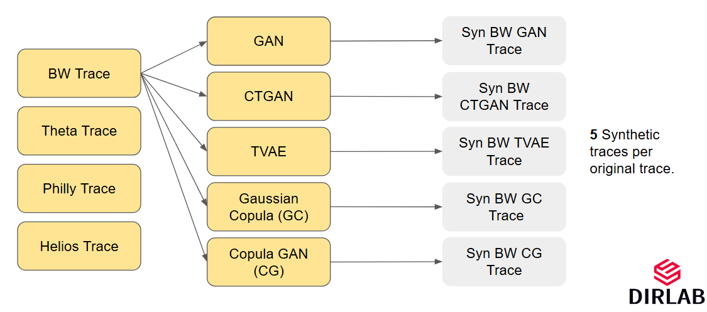

## Overview

The Gen-Parallel-Workloads repository contains generated and training data for job traces from various high-performance computing clusters, including `BW`, `Theta`, `Philly`, and `Helios`, designed to facilitate the comparison of machine learning models for synthetic job trace generation. 

This table includes all the traces included in this repo and their download links. These data can be used for training and benchmarking various scheduling decisions.

**Notes that, all generated job traces have 15,000 jobs. The original job traces are also cut to the latest 15,000 jobs.**

| Original Job Traces | Metadata | GAN-Gen | CTGAN-Gen* | TVAE-Gen* | GC-Gen | CGAN-Gen |
|---------------------|----------|---------|------------|-----------|--------|----------|
| [**BlueWater**](https://github.com/DIR-LAB/Gen-Parallel-Workloads/blob/main/BW/training_data/blue_waters_data_training.csv) | **NCSA**, 26,864 Nodes, 396K Cores, 4,228 GPUs | [BW-GAN](https://github.com/DIR-LAB/Gen-Parallel-Workloads/blob/main/BW/generated_data/synthetic_data_gan_bw.csv) | [BW-CTGAN](https://github.com/DIR-LAB/Gen-Parallel-Workloads/blob/main/BW/generated_data/synthetic_data_ctgan_bw.csv) | [BW-TVAE](https://github.com/DIR-LAB/Gen-Parallel-Workloads/blob/main/BW/generated_data/synthetic_data_tvae_bw.csv) | [BW-GC](https://github.com/DIR-LAB/Gen-Parallel-Workloads/blob/main/BW/generated_data/synthetic_data_gc_bw.csv) | [BW-CGAN](https://github.com/DIR-LAB/Gen-Parallel-Workloads/blob/main/BW/generated_data/synthetic_data_cg_bw.csv)|
| [**Theta**](https://github.com/DIR-LAB/Gen-Parallel-Workloads/blob/main/Theta/training_data/theta_data_training.csv) | **ALCF**, 4,392 Nodes, 281,088 Cores | [Theta-GAN](https://github.com/DIR-LAB/Gen-Parallel-Workloads/blob/main/Theta/generated_data/synthetic_data_gan_theta.csv) | [Theta-CTGAN](https://github.com/DIR-LAB/Gen-Parallel-Workloads/blob/main/Theta/generated_data/synthetic_data_ctgan_theta.csv) | [Theta-TVAE](https://github.com/DIR-LAB/Gen-Parallel-Workloads/blob/main/Theta/generated_data/synthetic_data_tvae_theta.csv) | [Theta-GC](https://github.com/DIR-LAB/Gen-Parallel-Workloads/blob/main/Theta/generated_data/synthetic_data_gc_theta.csv) | [Theta-CGAN](https://github.com/DIR-LAB/Gen-Parallel-Workloads/blob/main/Theta/generated_data/synthetic_data_cg_theta.csv)|
| [**Helios**](https://github.com/DIR-LAB/Gen-Parallel-Workloads/blob/main/Helios/training_data/helios_data_training.csv) | **Sensetime**, 802 Nodes, 6,416 GPUs | [Helios-GAN](https://github.com/DIR-LAB/Gen-Parallel-Workloads/blob/main/Helios/generated_data/synthetic_data_gan_helios.csv) | [Helios-CTGAN](https://github.com/DIR-LAB/Gen-Parallel-Workloads/blob/main/Helios/generated_data/synthetic_data_ctgan_helios.csv) | [Helios-TVAE](https://github.com/DIR-LAB/Gen-Parallel-Workloads/blob/main/Helios/generated_data/synthetic_data_tvae_helios.csv) | [Helios-GC](https://github.com/DIR-LAB/Gen-Parallel-Workloads/blob/main/Helios/generated_data/synthetic_data_gc_helios.csv) | [Helios-CGAN](https://github.com/DIR-LAB/Gen-Parallel-Workloads/blob/main/Helios/generated_data/synthetic_data_cg_helios.csv)|
| [**Philly**](https://github.com/DIR-LAB/Gen-Parallel-Workloads/blob/main/Philly/training_data/philly_data_training.csv) | **Microsoft**, 552 Nodes, 2,490 GPUs | [Philly-GAN](https://github.com/DIR-LAB/Gen-Parallel-Workloads/blob/main/Philly/generated_data/synthetic_data_gan_philly.csv) | [Philly-CTGAN](https://github.com/DIR-LAB/Gen-Parallel-Workloads/blob/main/Philly/generated_data/synthetic_data_ctgan_philly.csv) | [Philly-TVAE](https://github.com/DIR-LAB/Gen-Parallel-Workloads/blob/main/Philly/generated_data/synthetic_data_tvae_philly.csv) | [Philly-GC](https://github.com/DIR-LAB/Gen-Parallel-Workloads/blob/main/Philly/generated_data/synthetic_data_gc_philly.csv) | [Philly-CGAN](https://github.com/DIR-LAB/Gen-Parallel-Workloads/blob/main/Philly/generated_data/synthetic_data_cg_philly.csv)|


## Structure

- **BW, Theta, Philly, Helios**: Directories for each cluster, containing:
  - **generated_data**: Synthetic traces generated by different ML models.
  - **training_data**: Original traces used to train the models.
- **SDSC-95**: Additional data including traces generated by statistical methods.
- **Readme.md**: Documentation of the repository.

## Models

Five machine learning models, listed below, are utilized to generate synthetic traces for each original workload or job trace. Please refer to the `Example` section below for more details on how these models are applied.

- **GAN (Generative Adversarial Network)**
- **CTGAN (Conditional GAN)**
- **TVAE (Tabular Variational Autoencoder)**
- **Gaussian Copula**
- **Copula GAN**

### Example

Original job traces from the Blue Waters dataset were used to train five models, producing five synthetic traces for each original trace (as shown in image below). This process was replicated for all listed datasets, providing a broad basis for analysis and comparison across different machine learning techniques.



## Data Format

Each trace includes several key columns such as:
| Column Name | Description |
| ----------- | ----------- |
| **u id**        | A unique identifier assigned to each job |
| **user**        | User ID, an identifier assigned to distinct users |
| **gpu num**     | Number of GPUs a job uses |
| **cpu num**     | Number of CPUs a job uses |
| **node num**    | Number of Nodes a job uses |
| **interval**    | Time taken for a job to arrive after the previous job was submitted |
| **run time**    | Total time a job was running |
| **wall time**   | Total time a job spent in the system from submit to completion |
| **new status**  | Status of the job, when it was completed (Pass, Failed, Killed) |

## Citation

Please cite the following paper if you use this dataset or repository in your research:

```bibtex
@inproceedings{SoundarRaj2024Empirical,
  title={An Empirical Study of Machine Learning-based Synthetic Job Trace Generation Methods},
  author={Monish Soundar Raj and Thomas MacDougall and Di Zhang and Dong Dai},
  booktitle={Workshop on Job Scheduling Strategies for Parallel Processing},
  year={2024},
  organization={Springer}
}
```
